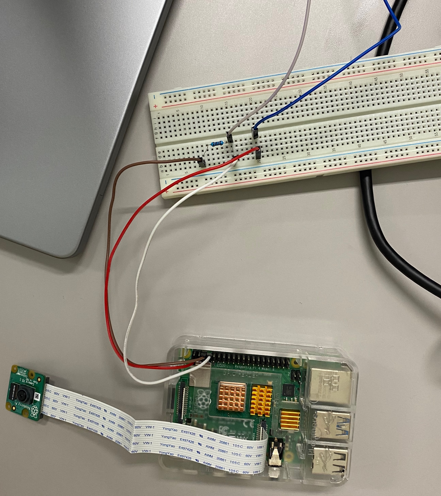

# WantedWaribashi

割り箸を取ろうとした人物の写真を撮る

## 必要なもの
* [Raspberripi B4](https://www.amazon.co.jp/stores/page/6FB6791D-C560-414E-8CE7-93196F833E20/?_encoding=UTF8&store_ref=SB_A1ZAO6RHVLJN98&pd_rd_plhdr=t&aaxitk=16248462b9171410dc338d415aafc683&hsa_cr_id=3642752260703&lp_asins=B08D6CYBNS%2CB09Q5M6W8T&lp_query=raspberry%20pi&lp_slot=auto-sparkle-hsa-tetris&ref_=sbx_be_s_sparkle_ssd_page_0_img&pd_rd_w=swNdQ&content-id=amzn1.sym.940fa71d-7f78-44a7-86e7-0cc4901f1d5f%3Aamzn1.sym.940fa71d-7f78-44a7-86e7-0cc4901f1d5f&pf_rd_p=940fa71d-7f78-44a7-86e7-0cc4901f1d5f&pf_rd_r=Q50GXA7SMH63DQ1AQHQS&pd_rd_wg=0r6bQ&pd_rd_r=d4b71eec-5eec-47ac-98cb-325d215a052e)
* [カメラモジュール](https://www.amazon.co.jp/gp/product/B07W6NK7TW/ref=ppx_yo_dt_b_asin_title_o00_s00?ie=UTF8&psc=1)
* [リードスイッチ](https://akizukidenshi.com/catalog/g/gP-13371/)
* [ブレッドボード](https://www.amazon.co.jp/%E5%88%9D%E5%BF%83%E8%80%85%E6%BC%94%E7%BF%92%E7%94%A8%E3%83%91%E3%83%BC%E3%83%84%E3%82%BB%E3%83%83%E3%83%88-%E5%9B%9E%E8%B7%AF%E9%85%8D%E7%B7%9A%E5%9B%B3%E3%81%A8%E3%82%B5%E3%83%B3%E3%83%97%E3%83%AB%E3%82%B9%E3%82%B1%E3%83%83%E3%83%81%E6%9C%89%E3%82%8A-%E3%82%B9%E3%82%BF%E3%83%BC%E3%82%BF%E3%83%BC%E5%AD%A6%E7%BF%92%E3%82%AD%E3%83%83%E3%83%88-%E3%83%AA%E3%83%AC%E3%83%BC%E3%83%A2%E3%82%B8%E3%83%A5%E3%83%BC%E3%83%AB%E5%88%B6%E5%BE%A1-%E8%B5%A4%E5%A4%96%E7%B7%9A%E3%83%AA%E3%83%A2%E3%82%B3%E3%83%B3%E7%AD%89IoT%E3%82%92%E5%AE%9F%E8%B7%B5%E3%81%99%E3%82%8B%E9%9B%BB%E5%AD%90%E9%83%A8%E5%93%81%E3%82%BB%E3%83%83%E3%83%88/dp/B01M6ZFNSS/ref=sr_1_12_sspa?adgrpid=119548918527&hvadid=626702842288&hvdev=c&hvqmt=e&hvtargid=kwd-34820980972&hydadcr=27487_14609489&jp-ad-ap=0&keywords=raspberry+pi&qid=1680190439&sr=8-12-spons&psc=1&spLa=ZW5jcnlwdGVkUXVhbGlmaWVyPUEzU0hKR0pYVUFDWVpSJmVuY3J5cHRlZElkPUEwMDU4ODU1M0RYVVJYM0Q3VERCJmVuY3J5cHRlZEFkSWQ9QTI5MktLWUZYU1RBNzQmd2lkZ2V0TmFtZT1zcF9tdGYmYWN0aW9uPWNsaWNrUmVkaXJlY3QmZG9Ob3RMb2dDbGljaz10cnVl)
* [10kΩ抵抗](https://www.amazon.co.jp/%E5%88%9D%E5%BF%83%E8%80%85%E6%BC%94%E7%BF%92%E7%94%A8%E3%83%91%E3%83%BC%E3%83%84%E3%82%BB%E3%83%83%E3%83%88-%E5%9B%9E%E8%B7%AF%E9%85%8D%E7%B7%9A%E5%9B%B3%E3%81%A8%E3%82%B5%E3%83%B3%E3%83%97%E3%83%AB%E3%82%B9%E3%82%B1%E3%83%83%E3%83%81%E6%9C%89%E3%82%8A-%E3%82%B9%E3%82%BF%E3%83%BC%E3%82%BF%E3%83%BC%E5%AD%A6%E7%BF%92%E3%82%AD%E3%83%83%E3%83%88-%E3%83%AA%E3%83%AC%E3%83%BC%E3%83%A2%E3%82%B8%E3%83%A5%E3%83%BC%E3%83%AB%E5%88%B6%E5%BE%A1-%E8%B5%A4%E5%A4%96%E7%B7%9A%E3%83%AA%E3%83%A2%E3%82%B3%E3%83%B3%E7%AD%89IoT%E3%82%92%E5%AE%9F%E8%B7%B5%E3%81%99%E3%82%8B%E9%9B%BB%E5%AD%90%E9%83%A8%E5%93%81%E3%82%BB%E3%83%83%E3%83%88/dp/B01M6ZFNSS/ref=sr_1_12_sspa?adgrpid=119548918527&hvadid=626702842288&hvdev=c&hvqmt=e&hvtargid=kwd-34820980972&hydadcr=27487_14609489&jp-ad-ap=0&keywords=raspberry+pi&qid=1680190439&sr=8-12-spons&psc=1&spLa=ZW5jcnlwdGVkUXVhbGlmaWVyPUEzU0hKR0pYVUFDWVpSJmVuY3J5cHRlZElkPUEwMDU4ODU1M0RYVVJYM0Q3VERCJmVuY3J5cHRlZEFkSWQ9QTI5MktLWUZYU1RBNzQmd2lkZ2V0TmFtZT1zcF9tdGYmYWN0aW9uPWNsaWNrUmVkaXJlY3QmZG9Ob3RMb2dDbGljaz10cnVl)
* [ジャンパワイヤ](https://www.amazon.co.jp/%E5%88%9D%E5%BF%83%E8%80%85%E6%BC%94%E7%BF%92%E7%94%A8%E3%83%91%E3%83%BC%E3%83%84%E3%82%BB%E3%83%83%E3%83%88-%E5%9B%9E%E8%B7%AF%E9%85%8D%E7%B7%9A%E5%9B%B3%E3%81%A8%E3%82%B5%E3%83%B3%E3%83%97%E3%83%AB%E3%82%B9%E3%82%B1%E3%83%83%E3%83%81%E6%9C%89%E3%82%8A-%E3%82%B9%E3%82%BF%E3%83%BC%E3%82%BF%E3%83%BC%E5%AD%A6%E7%BF%92%E3%82%AD%E3%83%83%E3%83%88-%E3%83%AA%E3%83%AC%E3%83%BC%E3%83%A2%E3%82%B8%E3%83%A5%E3%83%BC%E3%83%AB%E5%88%B6%E5%BE%A1-%E8%B5%A4%E5%A4%96%E7%B7%9A%E3%83%AA%E3%83%A2%E3%82%B3%E3%83%B3%E7%AD%89IoT%E3%82%92%E5%AE%9F%E8%B7%B5%E3%81%99%E3%82%8B%E9%9B%BB%E5%AD%90%E9%83%A8%E5%93%81%E3%82%BB%E3%83%83%E3%83%88/dp/B01M6ZFNSS/ref=sr_1_12_sspa?adgrpid=119548918527&hvadid=626702842288&hvdev=c&hvqmt=e&hvtargid=kwd-34820980972&hydadcr=27487_14609489&jp-ad-ap=0&keywords=raspberry+pi&qid=1680190439&sr=8-12-spons&psc=1&spLa=ZW5jcnlwdGVkUXVhbGlmaWVyPUEzU0hKR0pYVUFDWVpSJmVuY3J5cHRlZElkPUEwMDU4ODU1M0RYVVJYM0Q3VERCJmVuY3J5cHRlZEFkSWQ9QTI5MktLWUZYU1RBNzQmd2lkZ2V0TmFtZT1zcF9tdGYmYWN0aW9uPWNsaWNrUmVkaXJlY3QmZG9Ob3RMb2dDbGljaz10cnVl)

## 配線の例

## Usage
1. git clone this page.
2. get LINE access token from [LINE developers](https://account.line.biz/login?redirectUri=https%3A%2F%2Fdevelopers.line.biz%2Fconsole%2F)
3. export LINE_TOKEN=`xxxxxxx`
4. `python leadswitch.py`
5. When you speak the lead switch, Hiroyuki speaks for you.